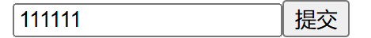
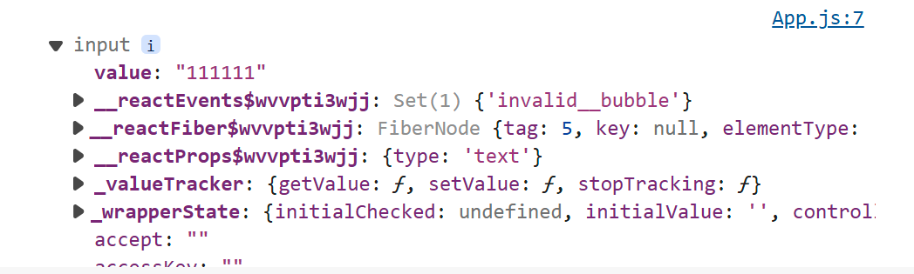

# React Hooks

#### useState 
useState 是一个 React Hook（函数），它允许我们向组件添加一个状态变量,  从而控制影响组件的渲染结果

1. **useState是一个函数，返回值是一个数组**
2. 数组中的第一个参数是状态变量，第二个参数是set函数用来修改状态变量
3. useState的参数将作为count的初始值

在React中，**<font color = 'red'>状态被认为是只读的，我们应该始终替换它而不是修改它，直接修改状态不能引发视图更新</font>**
下面的代码中修改count值只能由setCount实现

````
  //count:状态变量
  //setCount:修改状态变量的方法
  const [count, setCount] = useState(0);
  const clickHandler = () => {
    setCount(count + 1);
  }
  return (
    <div className="App">
      <button onClick={clickHandler}>{count}</button>
    </div>
  );
````

#### useRef
用于创建一个可变的引用对象，其 .current 属性被初始化为传入的参数（initialValue）。
在 React 组件中获取/操作 DOM，需要使用 useRef React Hook钩子函数，分为两步：
1. 使用useRef创建 ref 对象，并与 JSX 绑定
2. **在DOM可用时**，通过 inputRef.current 拿到 DOM 对象
   注意这里并不是绑定后即可拿到dom对象，而是渲染完毕后，即dom生成后才可用

 ````
  const inputRef = useRef(null);
  const showDom = () => {
    console.dir(inputRef.current);

  }

  return (
    <div className="App">
      <input type='text' ref={inputRef} />
      <button onClick={showDom}>提交</button>

    </div>
  );
 ````




#### useEffect
用于在React组件中创建不是由事件引起而是由渲染本身引起的操作（副作用）, 比
如发送AJAX请求，更改DOM等等

说明：上面的组件中没有发生任何的用户事件，组件渲染完毕之后就需要和服务器要数据，整个过程属于“只由渲染引起的操作”