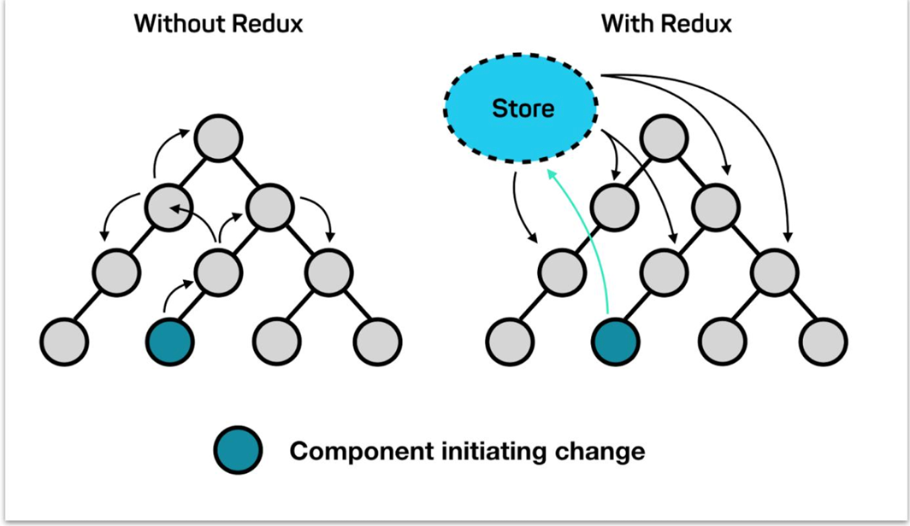

# Redux
Redux 是React最常用的集中状态管理工具，类似于Vue中的Pinia（Vuex），可以独立于框架运行
作用：通过集中管理的方式管理应用的状态


单独使用redux实现计数器
````
 // 1. 定义reducer函数 
  // 作用: 根据不同的action对象，返回不同的新的state
  // state: 管理的数据初始状态
  // action: 对象 type 标记当前想要做什么样的修改
  function reducer (state = { count: 0 }, action) {
    // 数据不可变：基于原始状态生成一个新的状态
    if (action.type === 'INCREMENT') {
      return { count: state.count + 1 }
    }
    if (action.type === 'DECREMENT') {
      return { count: state.count - 1 }
    }
    return state
  }

  // 2. 使用reducer函数生成store实例
  const store = Redux.createStore(reducer)

  // 3. 通过store实例的subscribe订阅数据变化
  // 回调函数可以在每次state发生变化的时候自动执行
  store.subscribe(() => {
    console.log('state变化了', store.getState())
    document.getElementById('count').innerText = store.getState().count
  })

  // 4. 通过store实例的dispatch函数提交action更改状态 
  const inBtn = document.getElementById('increment')
  inBtn.addEventListener('click', () => {
    // 增
    store.dispatch({
      type: 'INCREMENT'
    })
  })

  const dBtn = document.getElementById('decrement')
  dBtn.addEventListener('click', () => {
    // 减
    store.dispatch({
      type: 'DECREMENT'
    })
  })

  // 5. 通过store实例的getState方法获取最新状态更新到视图中

````
