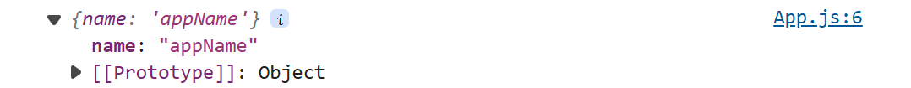
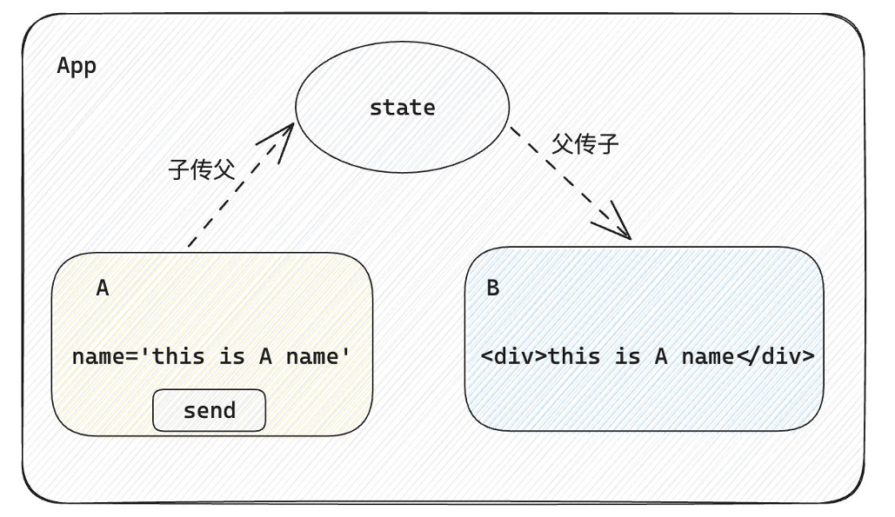
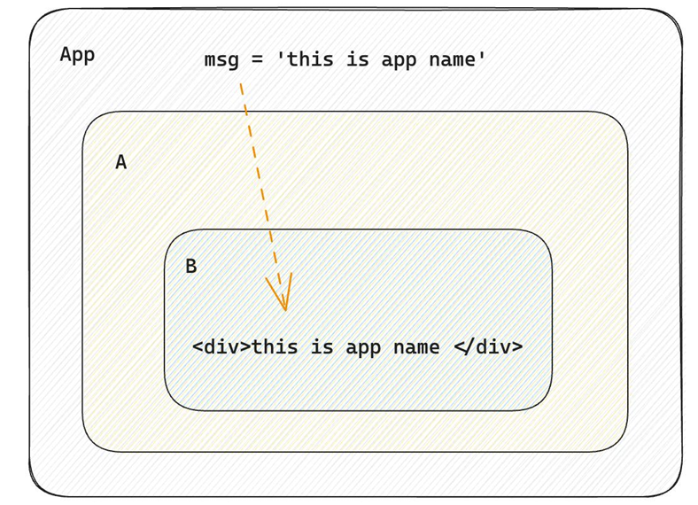

# 组件通信
#### 组件通信方法
1. A-B   父子通信
2. B-C  兄弟通信
3. A-E  跨层通信

````
function Son(props) {
  console.log(props);
  return <div>this is {props.name}</div>
}
function App() {
  const name = 'appName';

  return (
    <div>
      <Son name={name}>
      </Son>

    </div>
  );
}
````
上面的代码中，父组件App的name属性传递到了子组件Son中

显示结果：


#### 父传子props
1. **props可传递任意的数据**
数字、字符串、布尔值、数组、对象、函数、JSX
2. **props是只读对象**
子组件只能读取props中的数据，不能直接进行修改, 父组件的数据只能由父组件修改

当我们把内容嵌套在子组件标签中时，**父组件**会自动在名为children的prop属性中接收该内容（即子组件在父组件的children属性中）

#### 实现子传父
````
//从组件的 props 对象中提取出 onGetMsg 属性，并将其作为一个局部变量使用
function Son({ onGetMsg }) {
  const sonMsg = 'son message';
  return <div>
    <button onClick={() => onGetMsg(sonMsg)}>发送</button>
  </div>
}
function App() {
  const parentMsg = 'parent message';
  const getMsg = (msg) => {
    console.log(msg);
  }
  return (
    <div>
      <Son onGetMsg={getMsg}>
      </Son>

    </div>
  );
}
````
显示结果：


#### 使用状态提升实现兄弟组件通信

1. A组件先通过**子传父**的方式把数据传给父组件App
2. App拿到数据后通过**父传子**的方式再传递给B组件

````
import React, { useState } from 'react';

// 子组件 A
function A({ onGetName }) {
  const aName = 'A';
  console.log(`this is ${aName}`);

  // 假设有一个按钮来触发 getName 回调
  // 通过name实现子A传父App
  return (
    <div>
      <button onClick={() => onGetName(aName)}>发送</button>
    </div>
  );
}

// 子组件 B
function B({ bName }) {
  return (
    <div>
      <p>Received name: {bName}</p>
    </div>
  );
}

// 父组件 App
function App() {
  const [name, setName] = useState('');

  const getName = (name) => {
    console.log(name);
    setName(name);
  };

  return (
    <div>
      <A onGetName={getName}></A>
      //A按钮绑定点击事件调用getName后name存下aName值
      //父传子 name作为props传入B中
      <B bName={name}></B>
    </div>
  );
}

export default App;
````

#### Context机制实现跨层组件通信

1. 使用createContext方法创建一个上下文对象Ctx
2. 在顶层组件（App）中通过 Ctx.Provider 组件提供数据
3. 在底层组件（B）中通过 useContext 钩子函数获取消费数据

````
import React, { useState, createContext, useContext } from 'react';

// 使用createContext方法创建一个上下文对象
const NameContext = createContext();

// 子组件 A
function A() {
  const aName = 'A';
  console.log(`this is ${aName}`);

  // 获取并设置 Context 中的值
  const { setName } = useContext(NameContext);

  return (
    <div>
      <button onClick={() => setName(aName)}>发送</button>
    </div>
  );
}

// 子组件 B
function B() {
  const { name } = useContext(NameContext);
  return (
    <div>
      <p>Received name: {name}</p>
    </div>
  );
}

// 父组件 App
function App() {
  const [name, setName] = useState('');

  return (
    //在顶层组件（App）中通过 Ctx.Provider 组件提供数据
    <NameContext.Provider value={{ name, setName }}>
      <div>
        <A />
        <B />
      </div>
    </NameContext.Provider>
  );
}

export default App;
````
